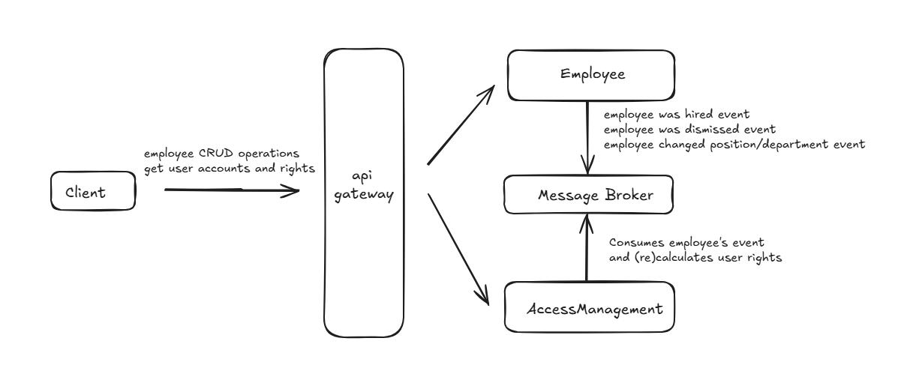

# Overview

The `IDM` - Identity Data Management - simple app in MSA format, that ensures the right users (that are part of the ecosystem connected to or within an enterprise) have the appropriate access to technology resources.

## Getting Started

To start application run `docker-compose up` command upon `docker-compose.xml` file in `deploy` folder.

### Services:
- EmployeeService - manages employee's events: hire, dismiss, change position and department.
- AccessManagement - manages employee's accounts in company and gives appropriate rights according role model.

